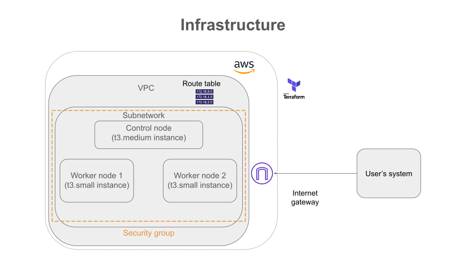

# Kubernetes cluster deployment in AWS using Kubeadm

## Requisites
- Having installed terraform in your system (Terraform v1.14.7 on linux_arm64 works well).

## Preliminaries
The first step is to build the infrastructure. We require 3 EC2 instances, one for the Control node, and two for the Worker nodes. The infrastructure is defined in `tasks/infrastructure/main.tf`.

To deploy it, make sure you have your AWS credentials in `~/.aws/credentials` in the format:

`[default]` 
`aws_access_key_id = *****************` 
`aws_secret_access_key = ******************`

You will also need an ssh key `~/.ssh/daily-key`. This key will be necessary to tunnel with machines inside the cluster.  

Then, within `tasks/infrastructure/main.tf` execute:

`terraform init` 
`terraform apply` 

Once you've done this, you will have the following VPC architecture available.

**Note:** When terraform finishes creating the infrastructure, it will print the Public IP address of all the VMs.

## Bootstraping the  the cluster
### Installing kubeadm
#### Install prerequistes in each node manually (To do this with Ansible check below)
- Check the MAC address of each node with `ip link show ens5` (or the name of the network interface indicated in the welcome banner of the ssh connection). You will obtain a number like *06:2b:c0:02:56:93*.

- Check the product_UUID with `sudo cat /sys/class/dmi/id/product_uuid`. All the MACs and product_UUID's must be different.

- To disable Swap memory use `sudo swapoff -a`, although normally it is disabled by default. You can check it with `swapon --show`, if there is no answer swap is off.

- To install the container runtime run the script `./admin_with_kubeadm/install_containerd.sh` in every node. Use `chmod +x install_containerd.sh` and `sudo bash install_containerd.sh` (or just `./install_containerd.sh`) to allow execution and execute respectively.

- To install the combo *kubectl + kubelet + kubeadm*, run the script `./admin_with_kubeadm/install_k8s_tools.sh` in every node.

- Configure a *cgroup driver* (control group): We need to make sure the container runtime and the Kubelet component match the *cgroup* driver. For this purpose, the best practice is to specify it in the configuration manifest located in `./tasks/admin_with_kubeadm/kubeadm-config.yaml`.

- Install *conntrack* in every node for the prechecks done by Kubeadm. This is part of the linux kernel but Ubuntu image doesn't include it.

    `sudo apt update`

    `sudo apt install conntrack -y`

#### Install prerequisites in each node using Ansible
##### Installing ansible (RHEL)
The control node will be your machine, and all the remote nodes will be managed nodes. 

- Install **podman** and **python3-pip**
    
    `sudo dnf install podman python3-pip -y`
- Create a virtual environment, and activate it

    `python3 -m venv ~/.ansible_venv` 
    `source ~/.ansible_venv/bin/activate`

- Install other prerequisites

    `sudo dnf install gcc python3-devel libffi-devel -y` 
    `sudo subscription-manager repos --enable codeready-builder-for-rhel-10-aarch64-rpms` 
    `sudo dnf install oniguruma-devel -y` 

- Install Ansible & Navigator
    `pip install --upgrade pip` 
    `pip install ansible-navigator ansible-core`

##### Using Ansible to install prerequsites

- Optionally, run the playbook **check_nodes.yaml** to verify connection with remote machines.

    `ansible-navigator run check_nodes.yaml -i inventory.ini`

- Then, run the ansible playbook that installs all the requirements in the remote machines.

    `ansible-navigator run k8s_setup.yaml -i inventory.ini`

### Install your K8s cluster with kubeadm
- Define a network setup for your pods. We defined this also in `./tasks/admin_with_kubeadm/kubeadm-config.yaml` with the CIDR *192.168.0.0/16* to make it clear that the pod network is fully isolated from the VPC network.

- Initialize your control plane node 

    `sudo kubeadm init --config kubeadm-config.yaml`

- Execute the following lines to configure kubectl

    `mkdir -p $HOME/.kube` 
    `sudo cp -i /etc/kubernetes/admin.conf $HOME/.kube/config` 
    `sudo chown $(id -u):$(id -g) $HOME/.kube/config`

- Take a note of the Kubeadm join command outputted by Kubeadm init. You will need it to join nodes eventually. It look something like this 

    `kubeadm join 10.0.1.163:6443 --token **************** \
        --discovery-token-ca-cert-hash sha256:3e3d81e6e7d2b7baef6571ac2ab21e1e397616b1d671dd828c74be38b84f4fb1 `

#### Install a Pod network in the cluster so that the Pods can talk to each other

- Once the cluster is up, and kubectl is connected to it, install the pod network addon *calico*

    `kubectl create -f https://raw.githubusercontent.com/projectcalico/calico/v3.29.1/manifests/tigera-operator.yaml`

    `kubectl create -f https://raw.githubusercontent.com/projectcalico/calico/v3.29.1/manifests/custom-resources.yaml`

- Add your worker nodes by running the *kubeadm join* command in each one of them.

- Now your cluster is ready to host the microservices of your application! To finish your session you can simply destroy your AWS resources with terraform (assuming you have already stopped all the resources from your applications).

## Certificate management with kubeadm
### How certificates are used by your cluster

There is a total of 10 mandatory certificates when creating a cluster manually (modulo the number of nodes).

<!-- *Dibujo de la dinamica de los certificados* -->

### Certificates for user accounts

<!-- *Dibujo* (son las cuentas de la componentes internas del cluser + los usuarios humanos). -->

Every service that is created inside the cluster is also assigned a Service Account.

### Choosing encryption algorithm (only for PKI certs, no secrets in general)

This is specified in `kubeadm-config.yaml`. We used RSA3072.

### Choosing certificate validity period

This is specified in `kubeadm-config.yaml`. We used 8760h for regular certs, and 87600h for CAs.

## Author

[Camilo Nuñez](https://github.com/camillonunez1998)

## License

[MIT](./LICENSE)
